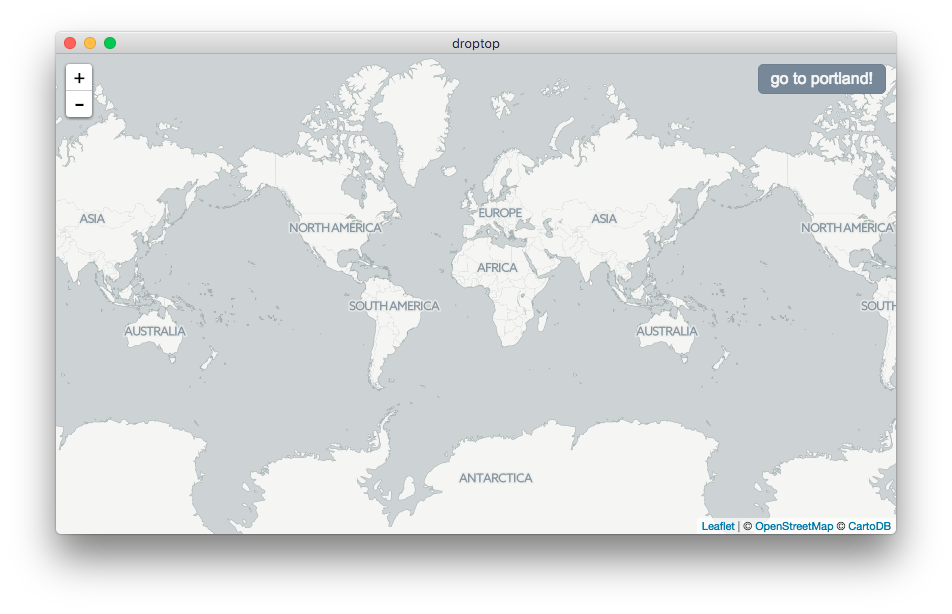

# droptop

Just experimenting with choo, leaflet, & electron for now. Looking to maybe rewrite [dropchop](https://github.com/cugos/dropchop) for desktop, with an eye towards the import geojson -> transform w/ turf -> export to svg workflow in particular.



**reference material**

- [cugos/dropchop](https://github.com/cugos/dropchop)
- [sethvincent/experiment-choo-leaflet](https://github.com/sethvincent/experiment-choo-leaflet)
- [mbloch/mapshaper](http://mapshaper.org)
- [NYCPlanning/postgis-preview](https://github.com/NYCPlanning/postgis-preview)
- [convo w/ sam & ingrid](https://twitter.com/vancematthews/status/759458736628830209)
- [mapzen/svg-export](https://github.com/mapzen/svg-export)

Ideas, feedback, & contribs most welcome. Drop 'em in the [issue tracker](../../issues/).

## install

```
git clone git@github.com:ungoldman/droptop.git
cd droptop
npm install
```

## run

```
npm start
```

## test

```
npm test
```
